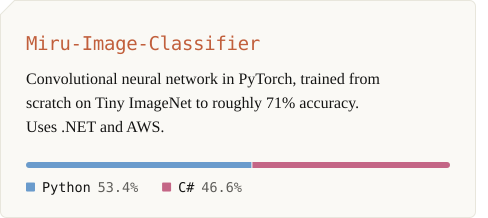
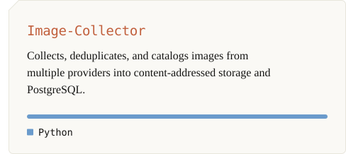
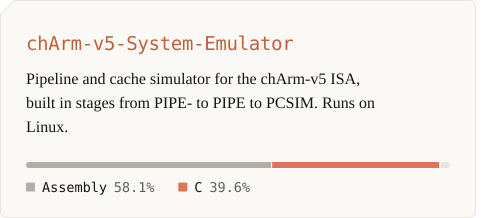
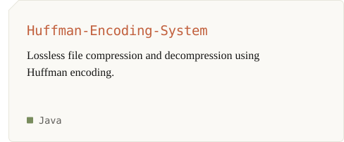
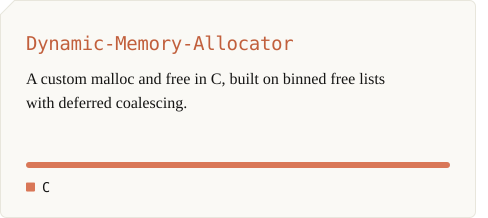
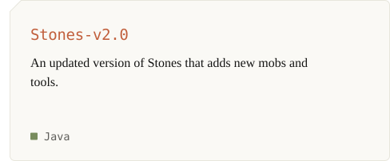
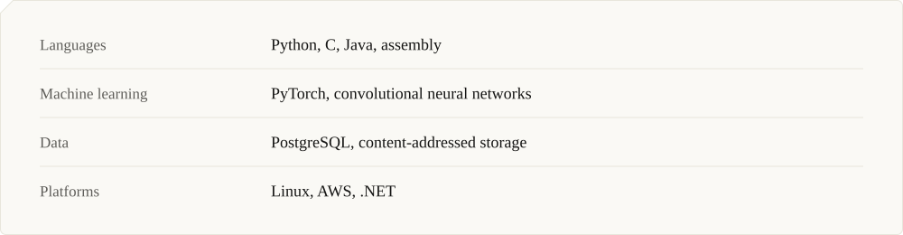

<!-- Generated by build.py. Edit the CONTENT section there and rerun it rather than editing this file by hand. -->

<picture><source media="(prefers-color-scheme: dark)" srcset="assets/hero-dark.svg"></picture>

<picture><source media="(prefers-color-scheme: dark)" srcset="assets/heading-projects-dark.svg"></picture>

<a href="https://github.com/stu-titor/Miru-Image-Classifier"><picture><source media="(prefers-color-scheme: dark)" srcset="assets/project-miru-image-classifier-dark.svg"></picture></a><a href="https://github.com/stu-titor/Image-Collector"><picture><source media="(prefers-color-scheme: dark)" srcset="assets/project-image-collector-dark.svg"></picture></a>

<a href="https://github.com/stu-titor/chArm-v5-System-Emulator"><picture><source media="(prefers-color-scheme: dark)" srcset="assets/project-charm-v5-system-emulator-dark.svg"></picture></a><a href="https://github.com/stu-titor/Huffman-Encoding-System"><picture><source media="(prefers-color-scheme: dark)" srcset="assets/project-huffman-encoding-system-dark.svg"></picture></a>

<a href="https://github.com/stu-titor/Dynamic-Memory-Allocator"><picture><source media="(prefers-color-scheme: dark)" srcset="assets/project-dynamic-memory-allocator-dark.svg"></picture></a><a href="https://github.com/stu-titor/Stones-v2.0"><picture><source media="(prefers-color-scheme: dark)" srcset="assets/project-stones-v2-0-dark.svg"></picture></a>

<picture><source media="(prefers-color-scheme: dark)" srcset="assets/heading-toolkit-dark.svg"></picture>

<picture><source media="(prefers-color-scheme: dark)" srcset="assets/toolkit-dark.svg"></picture>

<a href="https://www.linkedin.com/in/simon-shrestha-ab98a2363"><picture><source media="(prefers-color-scheme: dark)" srcset="assets/contact-dark.svg"></picture></a>

